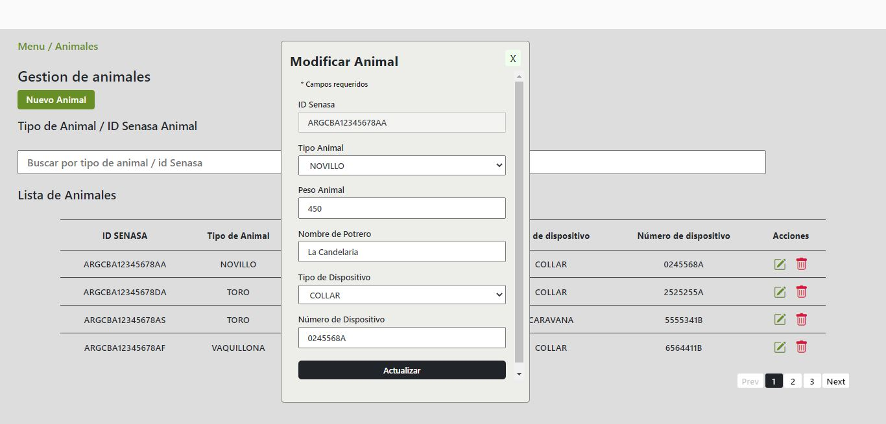

# Challenge Full Stack Developer

Formulario CRUD (Altas, Bajas, Modificaciones) de datos de vacas en formato desktop, utilizando React.js, node.js, Express y MongoDB.

## Features:

- Creación de registro de animales, que valida duplicación de ID Senasa.
- Modificación de datos de registros de animales.
- Eliminación de registros de animales, previa solicitud de confirmación.
- Paginado.
- Barra de filtro por ID Senasa o Tipo de Animal, que se mantiene mientras no se borre el criterio de búsqueda, por mas que se haga un nuevo llamado a la BD luego de un POST/DELETE/PUT.

# Intrucciones:

## Intrucciones para ejecutarlo localmente

Para correr el repositorio localmente se debe tener instalado previamente MongoDB y node.js, clonar una copia del repositorio y ejecutar en el mismo los siguientes comandos:

Backend (localhost:5001):

`cd api`

`npm install`

`npm start`

Frontend (localhost:3000):

`cd client`

`npm install`

`npm start`

## Intrucciones para correr los test

Backend:

`cd api`

`npm install`

`npm run test`

Frontend:

`cd client`

`npm install`

`npm run test`
 
 
 

## Screenshot

 

